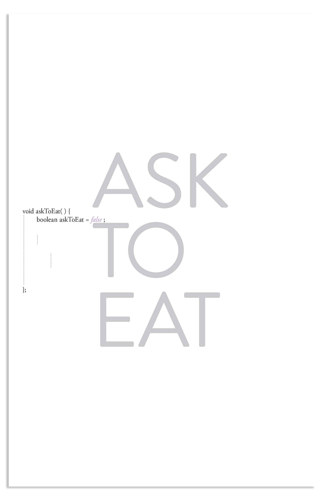
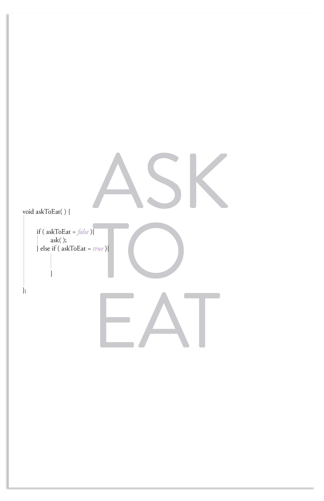
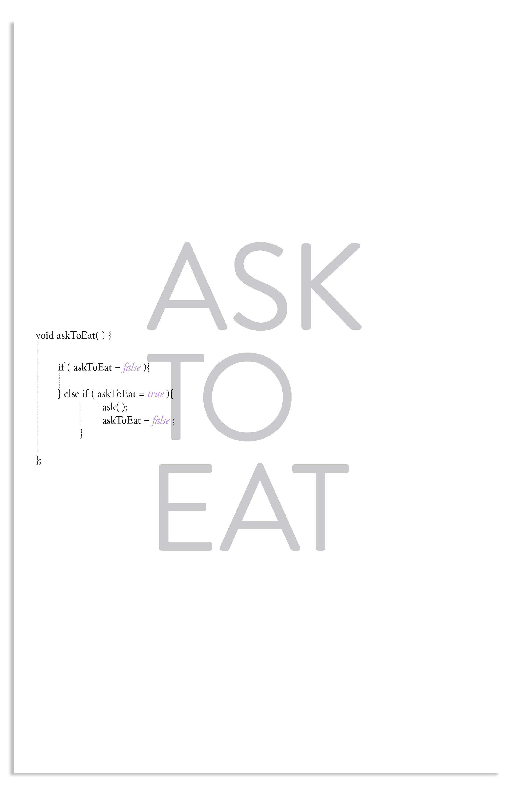
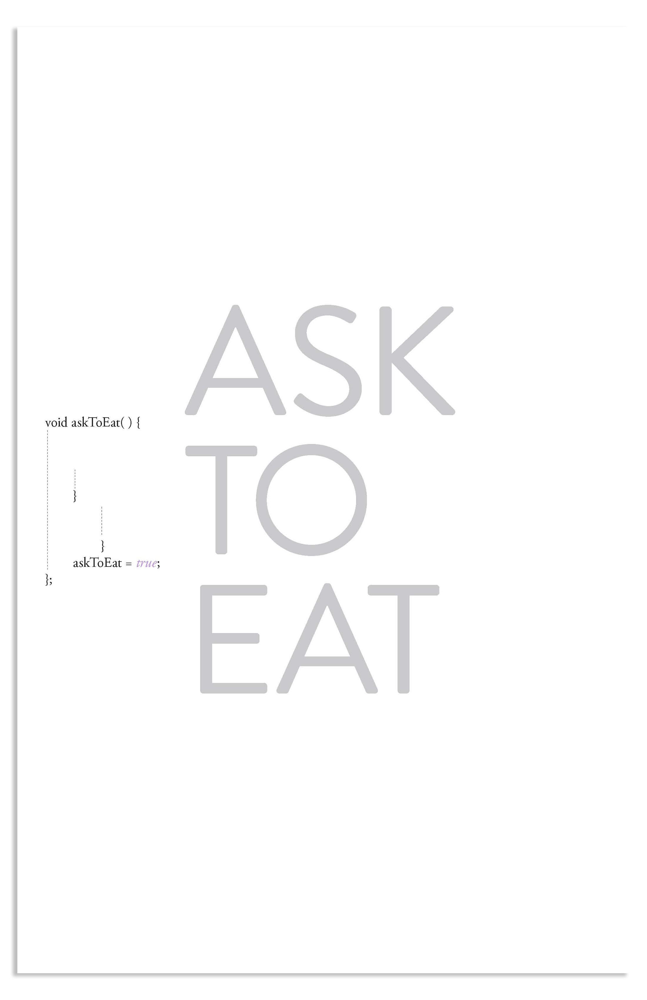

# Ask-To-Eat
### Whether or not I've eaten –it doesn't matter because to them I will always need to eat.
 
 1. They haven't asked yet today and I might or might not have eaten. 
 
 
 2. If they haven't asked yet, they will ask if I want to eat. 
 
 
 3. If they have asked –it doesn't matter, they will still ask if I want to eat.
 
 
 4. They will ask me if I want to eat, whether or not they asked me previously.
 
 

